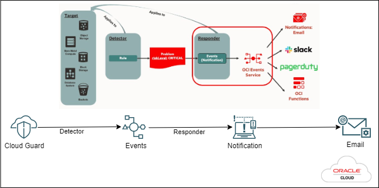

# OCI-CloudGuard
The Terraform code perform CloudGuard enablement and create a email notification service in your tenancy.

 ## Description  

The code help you to enable Oracle Cloud Guard in your tenancy along with an optional event and notification service. The notification service will trigger email notifications for the detected problems. 

## Architecture Diagram 

Here is a high level diagram for OCI Cloud Guard Workflow.



## Functionality of the Code

1. The service policy required for enabling the cloudguard will be added (if it was present then the code skip adding the policies)
2. Enable Oracle Cloud Guard in the tenancy.
3. Set the Traget where Cloud Guard need to get enabled (Tenancy level or compartment level)
4. Clone the existing Oracle managed Responder Recipe and create a new Responder Recipe. The code use Oracle managed Detector Recipes to detect the problems
5. Enable Cloud Event to publishes the problem details to Oracle Cloud Infrastructure Events Service
6. Create an email notification service to send detected problems via emails. (optional)
7. Confugure Oracle Cloud Infrastructure Events Service for Cloud Guard.


### Method: Deploy with Terraform CLI

### STEP 1.

Make sure Terraform installed in your local machine. verify using below command. 

```
Linux/Mac output

$ terraform --version

Terraform v0.12.16

Your version of Terraform is out of date! The latest version
is 0.12.17. You can update by downloading from https://www.terraform.io/downloads.html
------------------------------------------------------------------------------------------

Windows output

> terraform.exe -v
Terraform v0.15.3
on windows_amd64

Your version of Terraform is out of date! The latest version
is 1.0.3. You can update by downloading from https://www.terraform.io/downloads.html

```
### STEP 2.

Clone the repo from GitHub.com by executing the command as follows 
```
git clone https://github.com/balus7891/OCI-CloudGuard.git
```
### STEP 3. 
Navigate to the directory (OCI-CloudGuard) and update the appropriate values in **terraform.tfvars** file. Update each field carefully with the instructions mentioned as comments.

If you don't want to create any **Ecent and Notification Service** set the paramenter **ons_enabled = false**


All set !!! Now you are good to **RUN** the below.

**terraform init**

**terraform plan**

**terraform apply**

Refer the output for successful completion 

_To remove the service run the below_

**terraform destroy**


## Conclusion

###### The code help you easily enable cloud guard and associated configuratiions along with an optional event and notification service. 


## I hope the script helps !!!
Balasubramannyam Sunil 


